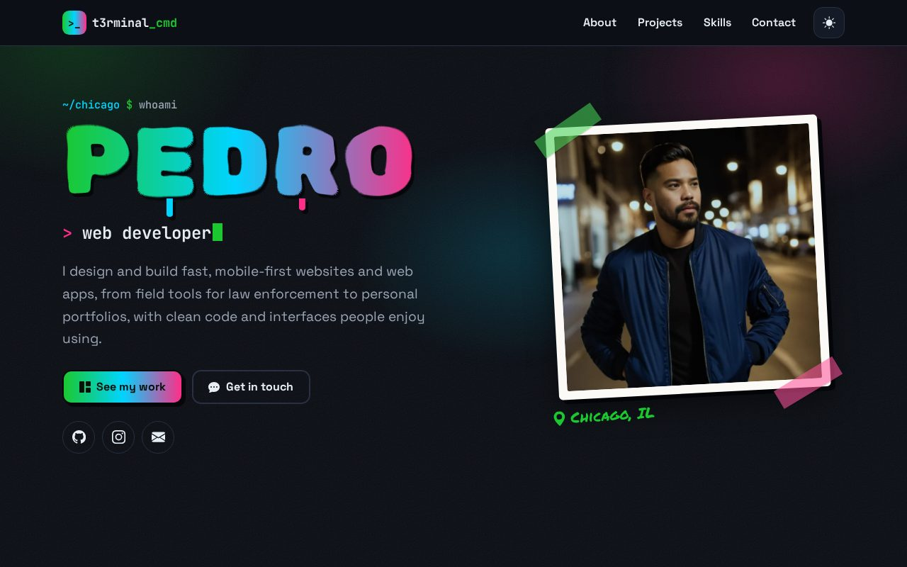
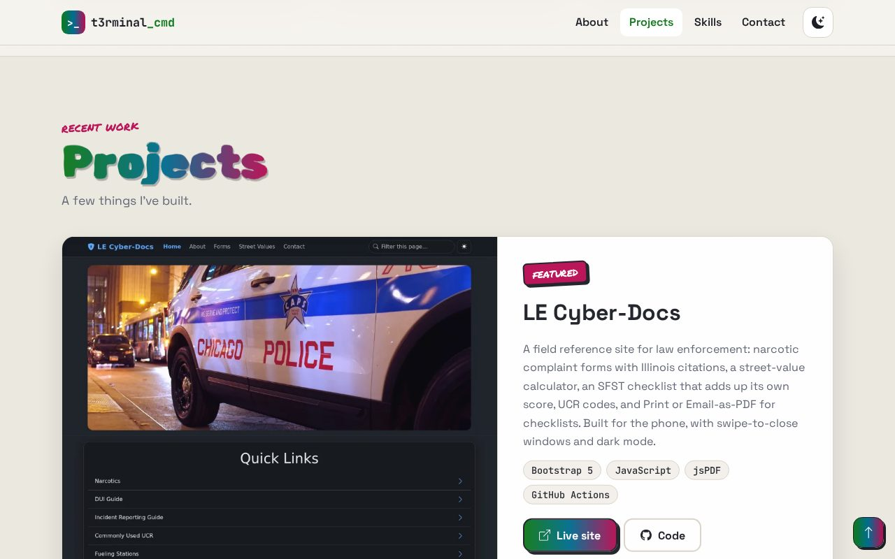
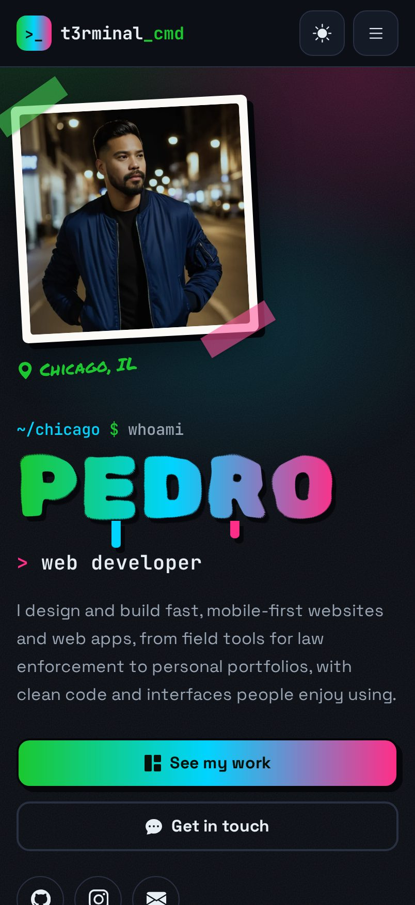

# Pedro | Web Developer & Designer

My personal portfolio: a single, fast, mobile-first page with my projects, what I do, the tools I use, and a contact form. It uses the same street-art look as my [GitHub profile](https://github.com/t3rminal-cmd): spray paint, marker tags and terminal prompts.

**Live:** https://t3rminal-cmd.github.io/Portfolio-Bootstrap/



<p>
  
  
</p>

## Features
- **Mobile-first layout.** Phones get a compact photo sticker at the top, a drop-down menu and full-width buttons. Tablets and desktops add columns.
- **Graffiti style:**
  - my name spray-painted in a green, cyan and pink gradient, with paint drips;
  - marker-style labels, a paste-up photo with tape, and paint-splat icons;
  - a terminal window for the skills list.
- **Dark / light theme.** Dark by default. It follows a light device setting, switches with one tap, and remembers your choice.
- **Hero** with a typing animation (web developer, web designer, photographer, runner, snowboarder, foodie).
- **Projects:** LE Cyber-Docs is featured, with live-site and code links on every card.
- **Contact form:** it checks the fields, then sends through [FormSubmit](https://formsubmit.co) without leaving the page. A hidden honeypot field catches spam bots.
- **Navigation:** a sticky bar that highlights the section you're reading, smooth scrolling, sections that fade in, and a back-to-top button.
- **Fast and private:** no frameworks and no CDNs. The fonts and icons are hosted in this repo, so the page makes no requests to other sites (apart from the contact form).
- **Accessible:**
  - a skip link, visible keyboard focus and labeled icon buttons;
  - alt text on every image, and real text behind the decorative lettering;
  - reduced-motion support, which turns off the animations.
- **Favicon and iPhone home-screen icon:** a `>_` terminal prompt.

## Project layout
```
index.html              The whole site, including the icon sprite
assets/css/styles.css   Theme colors, layout, graffiti effects, animations
assets/js/main.js       Theme toggle, phone menu, typing, nav highlight, reveal, back-to-top, contact form
assets/fonts/           Space Grotesk, JetBrains Mono, Rubik Spray Paint, Permanent Marker (licenses inside)
assets/img/             Hero photo and project screenshots (WebP)
assets/icons/           Favicon and Apple touch icon
screenshots/            Images used in this README
```

## Run locally
```bash
git clone https://github.com/t3rminal-cmd/Portfolio-Bootstrap.git
cd Portfolio-Bootstrap
python3 -m http.server 8000
# open http://localhost:8000
```

No build step and nothing to install.

## Editing
| To change… | Edit |
|---|---|
| Intro, About text, projects, skills | `index.html` |
| Typing animation words | `words` in `assets/js/main.js` |
| Colors (dark and light) | The variables at the top of `assets/css/styles.css`. `--paint-1`, `--paint-2` and `--paint-3` are the spray colors. |
| Contact form destination | The FormSubmit URL in the form's `action` in `index.html` |
| Add a project | Copy an `<article class="card project">` block in `index.html`, and add a screenshot (WebP, about 960px wide) to `assets/img/` |
| Add an icon | Copy the SVG from [Bootstrap Icons](https://icons.getbootstrap.com) into the sprite at the top of `index.html` as a `<symbol id="i-NAME">`, then use `<svg class="i"><use href="#i-NAME"/></svg>` |

## Deploying
Hosted on **GitHub Pages**. Every push to `main` runs **Deploy Site** (`.github/workflows/pages.yml`), which publishes `index.html` and `assets/`. The site updates in about 20 seconds.

One-time setup: Settings → Pages → Build and deployment → Source: **GitHub Actions**.

## Built with
HTML5 · CSS3 · JavaScript · [Bootstrap Icons](https://icons.getbootstrap.com) (MIT) · [FormSubmit](https://formsubmit.co)

The repo keeps its original name from when the site was built on Bootstrap; the current design no longer uses the Bootstrap framework.
