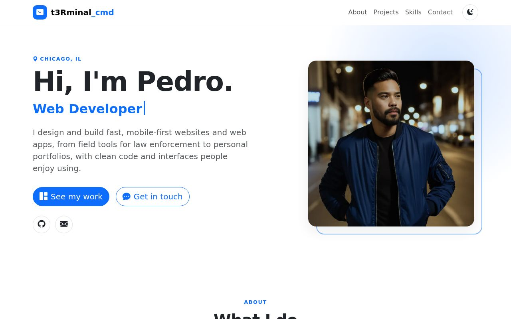
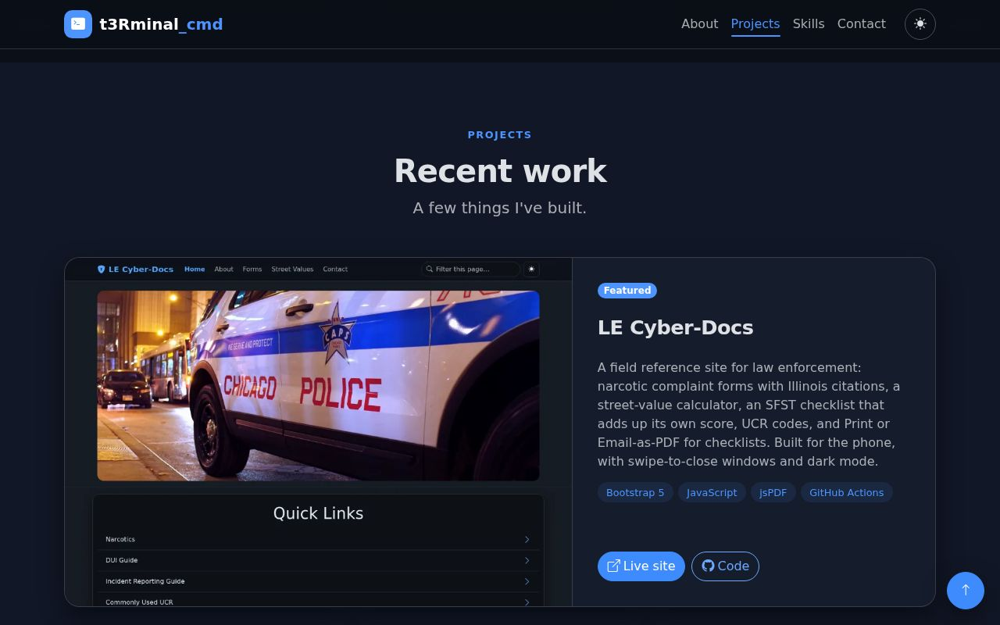

# Pedro | Web Developer & Designer

My personal portfolio: a single, fast, mobile-first page with my projects, what I do, the tools I use, and a contact form.

**Live:** https://portfolio-jazzy.netlify.app



<p>
  
  
</p>

## Features
- **Responsive, mobile-first layout** built with Bootstrap 5.3.
- **Dark / light theme:** follows the device setting, can be switched with one tap, and remembers your choice.
- **Hero** with a typing animation (developer, designer, photographer, runner, snowboarder, foodie).
- **Projects:** LE Cyber-Docs is featured, with live-site and code links on every card.
- **Skills** grouped by front end, back end and shipping/maintenance.
- **Contact form:** it checks the fields, then sends through [FormSubmit](https://formsubmit.co) without leaving the page. A hidden honeypot field catches spam bots.
- **Navigation:** a sticky nav that highlights the section you're reading, smooth scrolling, sections that fade in, and a back-to-top button.
- **Fast:** WebP images (about 120 KB in total, down from about 18 MB of PNGs), lazy loading, and a single icon set.
- **Accessible:**
  - a skip link and keyboard focus;
  - labeled icon buttons and alt text on every image;
  - reduced-motion support, which turns off the animations.
- **Favicon and iPhone home-screen icon:** a `>_` terminal prompt.

## Project layout
```
index.html              The whole site
assets/css/styles.css   Theme colors, layout, animations
assets/js/main.js       Theme toggle, typing, nav highlight, reveal, back-to-top, contact form
assets/img/             Hero photo and project screenshots (WebP)
assets/icons/           Favicon and Apple touch icon
screenshots/            Images used in this README
```

## Run locally
```bash
git clone https://github.com/t3rminal-cmd/Portfolio-Bootstrap.git
cd Portfolio-Bootstrap
python3 -m http.server 8000
# open http://localhost:8000
```

No build step. Bootstrap, Bootstrap Icons and the Poppins font load from CDNs.

## Editing
| To change… | Edit |
|---|---|
| Intro, About text, projects, skills | `index.html` |
| Typing animation words | `words` in `assets/js/main.js` |
| Colors (light and dark) | The variables at the top of `assets/css/styles.css` |
| Contact form destination | The FormSubmit URL in the form's `action` in `index.html` |
| Add a project | Copy a `<div class="col-md-6 col-lg-4">` project card in `index.html`, and add a screenshot (WebP, about 960px wide) to `assets/img/` |

## Deploying
Hosted on Netlify from the `main` branch. Every push to `main` republishes the site.

## Built with
HTML5 · CSS3 · JavaScript · [Bootstrap 5.3](https://getbootstrap.com) · [Bootstrap Icons](https://icons.getbootstrap.com) · [FormSubmit](https://formsubmit.co)
